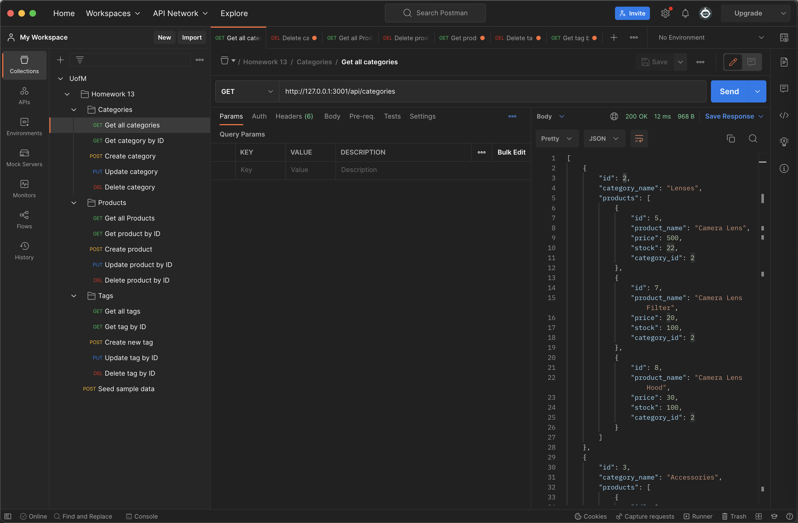
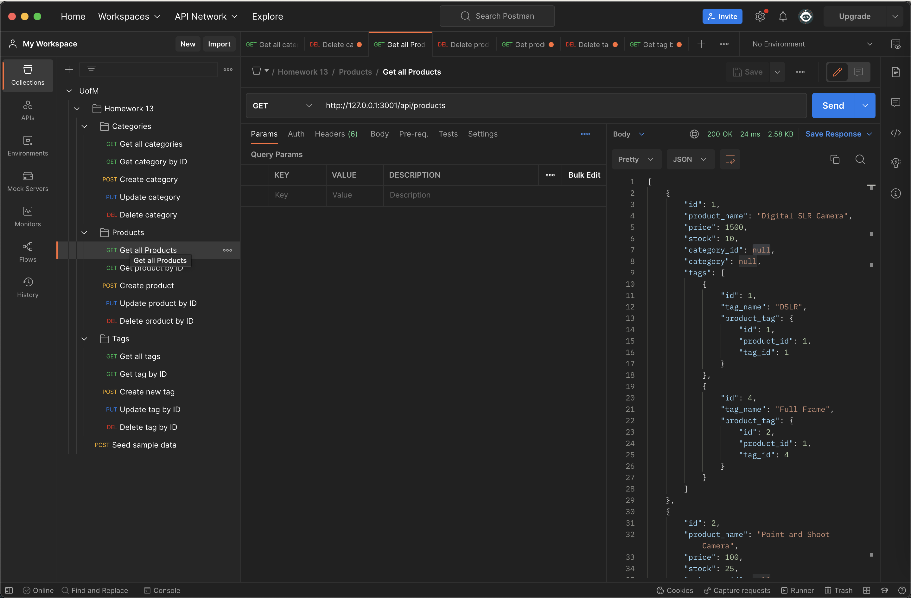

# Object-Relational Mapping (ORM): E-Commerce Back End

## Table of Contents:

1. [Description](#description)
2. [Links](#links)
3. [User Story](#user-story)
4. [Acceptance Criteria](#acceptance-criteria)
5. [Preview](#preview)

## Description

This is a simple back end for an e-commerce website. It uses the latest technologies, including Express.js API, Sequelize, and MySQL database. The database is seeded with test data. The application is invoked by using the command `npm run start`. The API GET, POST, PUT, and DELETE routes are tested in Postman.

## Links

- The repo of the tool: [Source Code](https://github.com/christopher211/awesome-camera-shop)

- Here is the link of demo video: [Google drive](https://drive.google.com/file/d/10LYD2INijLpGZgJqXcKHm62bVBYZoeRI/view?usp=share_link)

## User Story

```md
AS A manager at an internet retail company
I WANT a back end for my e-commerce website that uses the latest technologies
SO THAT my company can compete with other e-commerce companies
```

## Acceptance Criteria

```md
GIVEN a functional Express.js API
WHEN I add my database name, MySQL username, and MySQL password to an environment variable file
THEN I am able to connect to a database using Sequelize
WHEN I enter schema and seed commands
THEN a development database is created and is seeded with test data
WHEN I enter the command to invoke the application
THEN my server is started and the Sequelize models are synced to the MySQL database
WHEN I open API GET routes in Insomnia for categories, products, or tags
THEN the data for each of these routes is displayed in a formatted JSON
WHEN I test API POST, PUT, and DELETE routes in Insomnia
THEN I am able to successfully create, update, and delete data in my database
```

## Preview






